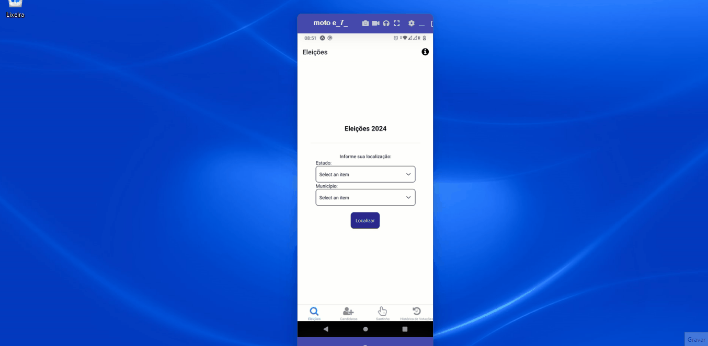

<h1 align="center">
     🐙 <a href="#" alt=""> React Native Test Polis</a>
</h1>

<h3 align="center">
    🧪 Mobile Test. 💚
</h3>

<h4 align="center">
	🚧 Development 🚀🚧
</h4>

### Prerequisites

Before you need install follow tools in your machine:
[Git](https://git-scm.com), [Node.js](https://nodejs.org/en/), [Android Studio](https://developer.android.com/studio).
Beyond is good to has an editor for to work with the code like [VSCode](https://code.visualstudio.com/)

# Summary

- [1. Overview](#1-overview)
  - [1.1 Stack](#11-stack)
  - [1.2. Auxiliary libs](#12-auxiliary-libs)
- [2. How To Run](#2-🔬-how-to-run)
  - [2.1 Containers](#21-containers)
    - [2.1.1 How to add a new library in containers](#211-new-library)
  - [2.2 Local](#22-local)
- [3. How to create a new branch](#3-new-branch)
  - [3.1 Commits](#31-commits)
- [5. Software Architecture](#4-software-architecture)
- [5. Recommended Extensions](#5-recommended-extensions)

# 1. Overview

Essa aplicação é uma ferramenta de apoio as pessoas no mundo político, a ideia é ser uma ferramenta versátil no que tange a esse escopo, auxiliando na tomada de decisão e fornecendo confiança através dos dados que irão orientar os usuários.


## 1.1. Stack

- [Typescript](https://www.typescriptlang.org/.docs/handbook/typescript-in-5-minutes.html)
- [Node](https://nodejs.org/en/about/) >= v18.17.1
- [GitHub](https://github.com/)
- [React Native](https://reactnative.dev/)

## 1.2. Auxiliary libs

- [Formik](https://formik.org/)
- [Yup](https://www.npmjs.com/package/yup)
- [Redux](https://redux.js.org/)
- [React-redux](https://react-redux.js.org/)
- [Reduxjs-toolkit](https://redux-toolkit.js.org/)
- [Redux-persist](https://www.npmjs.com/package/redux-persist)
- [Axios](https://axios-http.com/ptbr/docs/intro)

# 2. 🔬 How To Run

```bash

# Clone this repository
$ git clone https://github.com/LucasJunio/polis-mobile

# Acces the project folder in your terminal/cmd
$ cd polis-mobile


```

## 2.2. Local

Run the development server local with &quot;yarn&quot;, &quot;npm&quot;, &quot;pnpm&quot; or manager package your preference:

```bash

# Install dependencies
$ yarn install

# Run the project in your mobile phone, you can run another script options from package.json
$ yarn android

```

The aplication going to open in you expo app

Result:



# 3. How to create a new branch

Ever that's necessary to create a new branch feature, create by [main]branch, implement your development, merge this feature/branch to develop, when all it's ok, give a merge of this feature/branch to main[branch].

Let's go to follow the git flow patterns to create a new branch, to more info browse in link below to learn more how to implement in simple way.

Workflow gitflow: https://www.atlassian.com/br/git/tutorials/comparing-workflows/gitflow-workflow

```bash

# Example creating a new branch
$ git checkout -b feature/TASK-1

```

## 3.1. Commits

For commit your changes, you can follow the suggestion to use conventional commits [https://www.conventionalcommits.org/en/v1.0.0/] for to improve your commit descriptions and help the understand of the team. Exist a extension in vscode that can help you with this mission.

vscode extension id in .vscode/extensions.json:

"recommendations": ["vivaxy.vscode-conventional-commits"]

# 4. Software Architecture

Main folder tree and your goals

C:.

# 5. Recommended Extensions

You can check out a list of recommended extensions in the file `.vscode/extensions.json`, or by opening the "Extensions" Tab in the "Recommended" pane.

---

## 🦸 Author

<a href="https://madaztec.com/">
 
 <br />
 <sub><b>Lucas Junio</b></sub></a> <a href="https://madaztec.com/" title="Madaztec">🚀</a>
 <br />

---

## 📝 Licence

Made with ❤️ by Lucas Junio 👋🏽 [Contact](https://www.linkedin.com/in/lucas-junio/)
